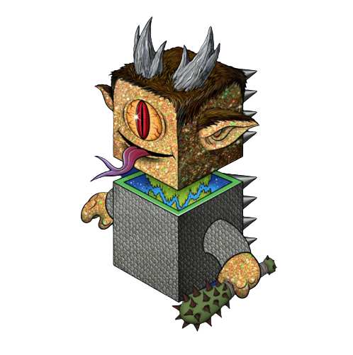

# 蜀山初现

夜色中，大营中传来冉将军的一声断喝："杀胡大计，无需再议，众将请回吧..."，众将领的低声应喝中，白衣书生亦默然而立不再做声，片刻之后弯腰一拜缓缓退出西蜀统帅大帐。

白衣书生转头遥看月色，双眼映照着月光闪闪发亮，思量片刻，走到马厩房牵出一匹黑色快马，打了声招呼出得守卫营，快马向瓦屋山麓狂奔而去。

今夜月色如银，一人一马如同闪电，跑的极快，不长时间就来到了瓦屋山麓一片巨石岩壁前。

马儿才停，白色身影从马背上一跃而起，顺着岩壁缝隙向上攀援而去，一会儿功夫，就见白影爬到岩壁高处一道隐约的黑色裂缝处，稍作停留，忽然闪身不见...

进去才发现，这是一个天然岩洞，开口处极窄，白衣书生慢慢往前挪动3\~4米，忽的脚下一松，身体往前落去，顺势滑入到一个巨大卵形模样的石室中。

书生收住脚步，滑到石室中央缓缓站稳，在黑暗中停留了一会儿，双眼便渐渐适应了环境。隐约向四周看去，石室中间地面有一丛青色的荧光若影若现。他缓缓摸到荧光前坐下，默默注视着这淡绿色，光芒下面隐约能看到一个黑色方块，一角向上，其余没入地下，方块表面隐约有符文凸起。

书生默默的注视着方块，想着无法阻止大军明日到瓦屋古镇补充军粮兵丁，心底里不由一阵黯然，瓦屋镇是幼年自己流落被收留之地，如今切要毁于战火，这如何是好。烦躁中书生不禁下意识向着荧光轻轻摸去。

心里想着，半个月前在这悬崖洞穴中无意中发现的黑色玄铁，处处透着怪异，不知道是何人留在此处，或许是一件宝物也未可知。一念之间，手指摸到方块中部凹线处发力轻插，方块丝毫不为不动。书生起了好奇心，非要把这方块起出来，于是顺手探到方块侧面凹槽处发力，想要看看能否松动，忽然间感觉指尖处一阵刺痛，仿佛被方块上凸起的符文棱角划破，一股暖流从指头留出，连忙收回手。

书生抬手一嗅，闻到浓厚血腥味。知道已被划伤出血。随手一甩，正在说倒霉，忽然感觉有异样，好像什么东西在随着自己的手指甩出血液触碰过来，像风又像细蚕丝，恍惚中，书生仿佛看到黑色方块在绿色荧光中像黑色的斗篷膨胀起来，一大蓬浓的化不开的黑雾像爆炸的孢子丝猛然间喷发出来。

还没来得及后退，就感觉无数的黑线从手指伤口、鼻子、耳朵... 钻了了进来。书生心中狂惧大喊，却没听到自己发出的半点声音，只感觉口里也钻进了无数的黑线，咬也咬不住，挡也没法挡。浑身像有一万亿只无比细小的钢针引着透明的纳米细丝在血管、筋肉、骨髓、脑颅里穿行交织，身体瞬间剧痛的失去了知觉晕了过去.....

瓦屋山孤峰状的山体矗立在峨眉以西，宽阔平坦的山顶平坦如桌，黎明将来之际，石室所在的西南角突然如同地震一般强烈的抖动起来，一座巨大的黑色方形山体像一个巨人从瓦屋山缓缓拔地而起，无数大小的岩石纷纷滚落，腾起大量尘土，黑色方山底部放射出奇异的青色光芒，缓缓向半空上升而去，伴随着一抹红色朝霞远远看去，只见了一股巍峨之气蒸腾云间，朝霞映射下，巨大的红金色方山云雾缭绕，宛如仙境灵山。

不远处的西蜀大营传来阵阵阵骚动，众多的军士将领聚集在一起，望向不远处烟气蒸腾发出巨震的瓦屋山，惊魂不定议论纷纷；只有旁里的一位老先生望着远处升腾而起的巨大山体，一屁股坐下，嘴里缓缓念叨 "蜀山已现、汉室必兴"....

远远望去，漂浮起一片仙山，细数总共十座仙山，九座浮空的小山体环绕着一座高耸的巨型方块仙山。 那一座方形山峰，宛如一尊定海昆仑，映射着金色的阳光，在山之上弥漫着一道道云雾，仿佛有剑意环绕，风过瑟瑟而鸣。

随着朝阳的升起，仙山越升越高，已入云端之上，隐约看到方山向蜀东峨眉山而去，缓缓在峨眉山万佛顶上空隐入不见.

白衣书生逐渐清醒过来，感觉身体充盈着说不出来的奇异能量，抬头向前方地面一看，所在的石室好像变成了一个半透明巨蛋，自己就在巨蛋的中央，目力所及之处，半透明的地面几乎没有任何延迟立刻清晰起来，毫无阻碍的的看到下面如同万丈深渊一般的峨眉上万佛顶，书生不由大惊，赶紧向后急退。于此同时，脑子里却轻响起了一个奇怪的清脆高音...

“白眉，别乱动乱跳，老老实实站住！”，这声音极细极脆，像是一个一个高音符从脑子里自动蹦了出来，完全听不出是什么方向发出的声音，但却让人心里像明镜一样的立刻明白。

书生下意识的问道：“你是誰，怎知我叫白眉，这里到底是什么地方....”， 话音还没出口，脑子里又传来了细音符：“说来话长，简单点说，我是龙胶囊平顶头，按你们的语言讲，可以算是你的守护神，你的身体被我征用了，不过你也不吃亏，我的身体和能耐都很大，也可以为你所用，哈哈哈。。。”

白眉心底又惊又惧，左手一把抓住配剑，压低声音怒呵一声：“用我的身体？你到底是什么人，赶紧现身吧，不然休怪我不客气...”，说罢就想拔剑，那知刚想动手，却被一股力量禁锢住，根本就只能想想，实际无法动得分毫。

脑子里传来细音符叹到：“唉，榆木脑袋，算了，现在说什么你也听不懂，先老老实实接受七天神龙知识的洗礼吧，睡一觉就可以传输完毕，你这个愚蠢而又幸运的的地球人...”

声音刚落 ，四周就逐渐暗了下去，缓缓的幻化成一片无边无际黑暗和沉寂的虚空，白眉感觉到自己的身体缓缓的旋转起来，慢慢的向下坠落，不停的坠向宇宙的最深处 ，下坠的速度也愈来愈快，无边无际的黑暗之中，远方的银河星系扑面而来，一瞬间极其璀璨的超新星大爆炸忽然在前方绽放开来.........

不知道何为时间、何为宇宙、何为星系..... 白眉感觉自己就像一粒微小的星尘，漂浮在无边的暗夜虚空之中，又像一尾银色的小鱼儿，在亿万年的时光里飞速的穿行着...

无数生命的影像从眼前一闪而过，无穷多的概念在头脑中连续爆炸，多维平行宇宙百万年的争斗史一晃而过，神龙文明的坠落就在刹那间发生，庞大的超光速曲率飞船划过太阳系地球轨道的边缘，无数巨大的方块状龙胶囊带着火焰从天而降，坠落向太阳系和地球各处，大地上漫游的恐龙迎来了灭顶之灾，无数巨型火山在刹那间喷发....&#x20;

一眨眼间，原始人类开始在草原上直立行走，手里握着第一件打磨过燧石刀工具........

神龙族长老的面孔一晃而过，耳中传来低沉的音符：“去与碳基生命结合，创造龙族文明新的未来....”，

无边无际的白色光芒中，白眉沉沉睡去。
