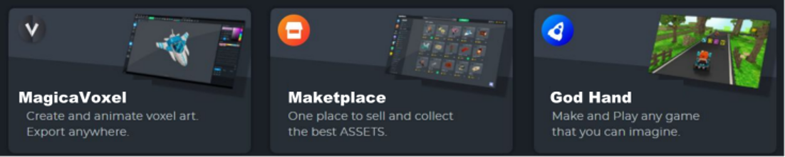

# 《DOMELAND》2022农历新年寄语

祝全球DC Holders 虎年新年快乐，《DragonCapsule》是**YieldDAO** 元宇宙职业公会创始团队讲述的第一个龙胶囊平行宇宙故事主线，欢迎对DC故事感兴趣的全球创作者加入_**YieldDAO DC-MPC**_（龙胶囊多维平行宇宙俱乐部）。

同时也邀请全球用户，一起来关注和参与第一个多元化IP故事背景的开放式冒险RPG+共创虚拟土地元宇宙 **《DOMELAND》**。

## 穹顶家园  《**DOMELAND**》

**1 项⽬简介**

《**DC** **DomeLand**》  是 **YieldDAO** **Metaverse** 旗下 **subDAO,** 它是⼀个可以使玩家利⽤游戏积分自行构建虚拟世界并且获得收益的元宇宙项目。 DC DOMELAND 翻译成中⽂是《穹顶家园》，基于《DRAGONCAPSULE》龙胶囊 IP 故事背景打造, 并将与业内领先的元宇宙产业伙伴（引擎⼚商、⼯具链、开源社区、游戏社群、YieldDAO元宇宙职业公 会、⽂化媒体产业） 展开⼴泛的合作，推动全球元宇宙玩家和合作伙伴在**DC** **DOMELAND** 中投资⼟地、展开建设、入住办公或拥有⾃⼰的虚拟化⾝⾓⾊ 。

《穹顶乐园》是元宇宙职业公会 **YieldDAO**推出的Metaverse虚拟世界，它是⼀个玩家可以⾃⾏构建虚拟世界并且获得收益的游戏项⽬。 **DC** **DOMELAND** 预计**2022**年末正式开启实施路线图，通过YieldDAO 旗下《**DC** **DOMELAND**》**SUBDAO** 展开全球合作。

.jpg>)

**2  ⼟地市场**

《DC DOMELAND》 中⼟地共有**786,600** 块LAND（共10000个DC)，每块都是⼀个ERC721 NFT，  拥有⼀块⼟地意味着玩家拥有了《DC DOMELAND》元宇宙的⼀部分。

完成《DC DOMELAND》元宇宙架构搭建的基础后，  预计2022年3季度开始第⼀批DOME LAND Block发⾏, 4季度开启实施路线图 , 届时持有DC的⽤户将成为第⼀批龙胶囊穹顶家园的原住⺠。

**3  配套⼯具**

DOMELAND有⾃治组织 DAO，  游戏中玩家可以利⽤ **GodHand** ⼯具创建游戏、开发⼟地， 也可以⽤  **MagicaVoxel**  软件⾃⾏创建 3D 虚拟建筑和物品，  并且在**Marketplace** 集市中交易获得经济效益。

**4**  **经济模式**

《**DC** **DOMELAND**》 的收入主要来⾃于出售⼟地、元宇宙虚拟资产NFTs出售、市场交易费（5%⼿续费）等。  收入的50% 由项目方⽀配, 其余⽤于**Stacking** 和发展YieldDAO DOMELAND元宇宙⽣态与社区。
