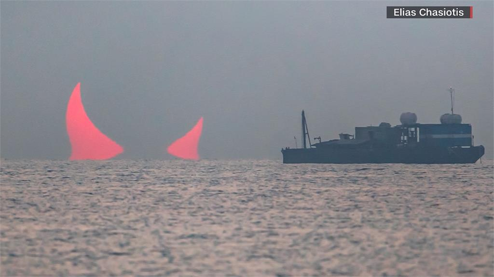

# 波斯湾魅影

2024年6月，波斯灣戰雲密布之時，美國太空總署公布的「每日一照」，近來引起全球輿論話題。這張照片是一名天文學家日前在波灣上拍到的，不過景象卻是「紅色惡魔的隻角」，有專家澄清，是日食所致.

1天之前，美国太空总署NASA、FBI与中国国家航天局CNSA，均得到来源可靠的消息，印度洋深海探测到了被未知力量激活的DC本体-海浪头，并正往波斯湾方向移动。

DC海浪头本体形态缓缓冒出波湾，巨浪涌横扫海面， 一座黑色小山一样的巨型方块浮出海面，一转眼间海浪头本体逐步变的半透明后逐步消失，双角幻化为波斯湾的红色恶魔角景象。
