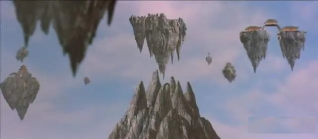

# 地外文明遗迹的崛起

波湾魅影的出现和隐身、启用了暗物质引擎，激发了同弦暗物质宇宙的震荡波。

峨眉金顶之上，传说中的蜀山忽然出现了，九座仙山，围绕着中心的一座擎天巨峰，高2千余米。

从金顶向上看去，就像是一片仙家圣地。

看见这一幕的人无不惊呆，满脸狂热和兴奋。

“蜀山！”

“这是蜀山？”

“天呐...世上真的有蜀山？”

峨眉金顶，无数游客们狂热的大喊着，大家纷纷拿出手机拍摄下虚空云层上面的震撼仙山。

就在一瞬之间，在暗物质引擎的强大作用下，蜀山一眨眼就隐入了暗物质平行宇宙，但蜀山出现的短短一刹那，大气层出现了一个空洞，太空中多个国家的侦查卫星拍到这一幕，蜀山已无法隐藏，势不可免将引起全球各方的关注。

同日，一份来历不明的神秘报告，寄到了中国国家航天局CNSA 地外文明研究中心，并快速通报到了国家安全局特情处理中心，汇同中央军委代表，白眉上将立刻启动了特情分析会议。

这份情报打破了一直以来想象中的地球和平，暴露出令人震惊的地外文明竞争情报态势，地外文明遗迹活动迹象已经在全球高频出现，包括了波湾海浪头、峨眉金顶蜀山、美国51区的巨型不明飞行物...。

根据该情报统计信息显示：美国NASA和中情局，目前收集确定了600多处高度疑似的地外文明遗迹启动器，已经展开对疑似外星文明的接触研究，并且针对地外文明第四类接触启动了特别宿主培养计划，目标是培养可以和地外文明深度接触甚至探索融合的国家特殊人才，代号【特洛伊】计划。

情报同样显示：俄罗斯、澳大利亚、英国、日本、芬兰等全球10余个国家也正在以国家力量成立不同形态的研究机构，研究和发掘地外文明遗迹资源。有类似美国宿主培养计划的国家至少包括日本、俄罗斯、澳大利亚等国家。

最让人震惊的是，对中国绝密计划的精准信息也在这份情报的统计列表之中，中国对地外文明的探索储备能力位列美国之后，目前收集锁定了500多处地外文明遗迹启动器，并精确点明了中国地外文明接触人才培养计划的官方代号为【封神榜】。

情报明确无误的告知，地外文明遗迹方块的规模存在和战略潜力已经被一部分国家内部明确确认，地外文明遗迹方块（龙胶囊）正在成为各国争先抢夺的战略资源，而这份情报，将会无差别的传递到全球各国首脑与国防部长办公室。

一场史无前例的地球文明进化未知的风暴已经悄悄的拉开了帷幕......

