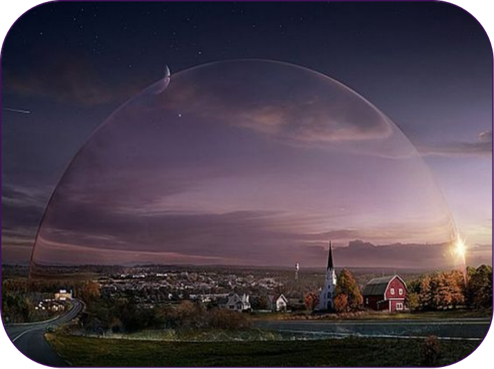

# 龙胶囊本体

坠落地球的DC(龙胶囊)原生形态非常巨大，边长可达数公里（我们称之为DC本体形态）

DC头顶可一个超重力场形成的穹顶空间，能够与地球环境相结合的区域、可以承载并保护各种土地和微生态（冰川、火山、海滩、草原、城市、广场……），能够呈现出地球上任何一处宏观或者微观的景象特征，也是神龙多维平行宇宙与人、地球自然的故事演绎过程在视觉上的主要呈现。


基于DC巨无霸本体宏大的故事背景，未来将设计启动《DOME LAND》去中心化虚拟土地元宇宙项目，DC的巨型化设定是构成龙胶囊元宇宙世界观的重要一步。


下图是 DOMELAND 元宇宙故事背景的数据规划

